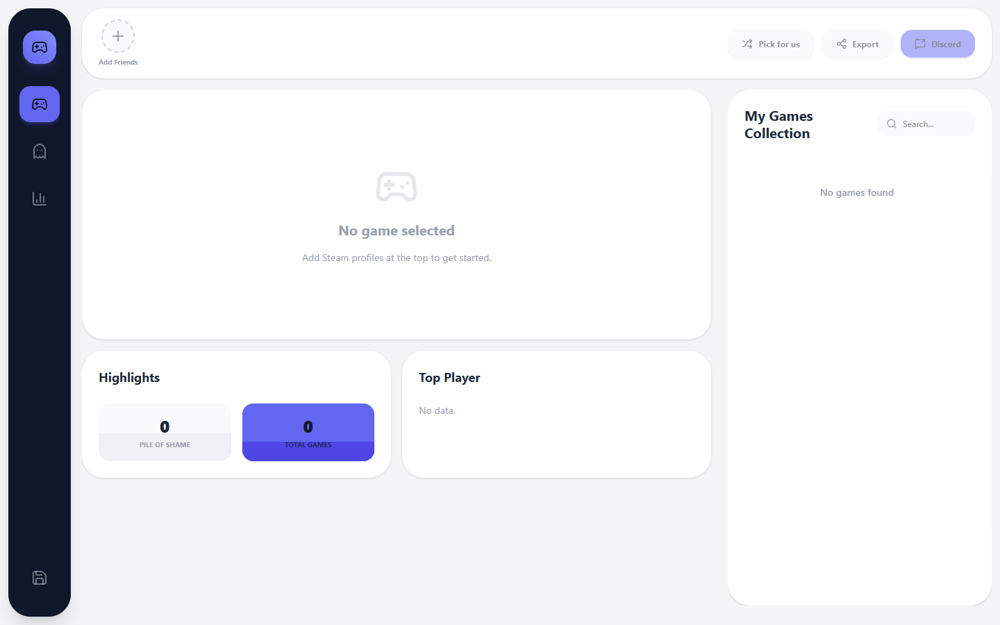

# PlayTonight

  

PlayTonight is the ultimate tool for PC gaming squads. Instead of manually comparing Steam libraries to figure out what to play, just enter your squad's Steam profiles and let the tool do the magic.

## 🚀 Features

- **Instant Multiplayer Filtering**: Analyzes up to 5 Steam profiles and instantly finds games you ALL own that have multiplayer/co-op tags.
- **The Missing Link**: Identifies highly-rated games that *almost* everyone in your squad owns (N-1), and displays the real-time Steam Store price so you can pressure the last person into buying it.
- **Remote Play Together**: Highlights games owned by at least one person that support "Remote Play Together", meaning the rest of the squad can join for free.
- **Squad RPG Badges**: Automatically analyzes playtime data to assign funny badges to your friends (The Tryhard, The Casual, The Collector, The One-Trick).
- **Export to Share**: Generates a sleek, social-media-ready PNG image of your squad's dashboard to share on Discord or Twitter.

## 🌐 Live App

The application is deployed and ready to use!
**Play now at:** [https://play-tonight.vercel.app/](https://play-tonight.vercel.app/)

## ⚙️ Tech Stack

- Next.js 16 (App Router)
- React 19
- Tailwind CSS v4
- Framer Motion
- Steam Web API
